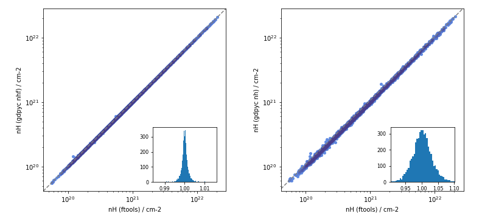

Comparison between gdpyc and HEASoft nh
---------------------------------------
The plots below compare the nh values obtained using gdpyc's
:meth:`~gdpyc.core.GasMap.nhf` (left) and :meth:`~gdpyc.core.GasMap.nh`
(right) methods against the results of the ``nh`` ftool included in HEASoft.

|LABscatter|

We obtained consistent results with both methods. The larger scatter for our
``nh`` method is expected due to the lower resolution of the map
(~1 vs 0.675 deg) and the interpolation technique.

Here we show the nh ratios for both methods in all-sky maps: ``nhf`` (left)
and ``nh`` (right).

|LABmap|

We included a `Jupyter notebook`_ in the documentation with the procedure 
to create these plots.

.. _`Jupyter notebook`: https://github.com/ruizca/gdpyc/blob/master/docs/nh_comparison.ipynb

